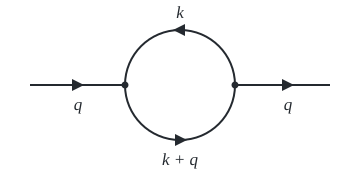

# zippel

A bunch libraries to support doing Feynman integral reduction by sparse interpolation over finite fields in Rust.

IBP systems are eliminated numerically modulo word-sized primes, and the exact rational coefficients are recovered from evaluations alone.

- [`zippel-interp`](crates/interp): Zippel's black-box sparse polynomial interpolation over prime fields
- [`zippel-interp::rational`](crates/interp/src/rational.rs): Rational function reconstruction ala the method of Thiele and Zippel
- [`zippel-interp::benor`](crates/interp/src/benor.rs): Ben-Or/Tiwari interpolation from about two evaluations per term
- [`zippel-interp::geometric`](crates/interp/src/geometric.rs): Sparse recovery with smooth-subgroup exponent decoding
- [`zippel-lift`](crates/lift): Lifts to Q by CRT and rational number reconstruction
- [`zippel-laporta`](crates/laporta): IBP generation and Laporta elimination over GF(p)
- [`zippel-gcd`](crates/gcd): Multivariate GCD, cofactors and LCM of [polycore](https://crates.io/crates/polycore) polynomials
- [`zippel-gcd::zippel`](crates/gcd/src/pgcd.rs): Zippel's modular GCD with LINZIP interpolation
- [`zippel-gcd::huang_gao`](crates/gcd/src/huang_gao.rs): Huang–Gao GCD by separated Hensel lifting (asymptotic SOTA, 2026)
- [`zippel-gcd::huang_monagan`](crates/gcd/src/huang_monagan.rs): Huang–Monagan GCD by prime substitution
- [`zippel-gcd::hu_monagan`](crates/gcd/src/hu_monagan.rs): Hu–Monagan GCD and cofactor interpolation
- [`zippel-gcd::hu_monagan_bivariate`](crates/gcd/src/hu_monagan.rs): Hu–Monagan GCD with bivariate images

```bash
cargo build
cargo test
```

```bash
cargo run -p zippel-interp --example determinant
cargo run -p zippel-interp --example linsolve
cargo run -p zippel-laporta --example hello
cargo run -p zippel-laporta --example bubble
cargo run --release -p zippel-laporta --example box
cargo run --release -p zippel-laporta --example double_box
cargo run -p zippel-gcd --example demo
```

## Example

The massless one-loop bubble with dots, reduced to its master integral $I(1,1)$, where

$$
I(a_1, a_2) = \int \frac{d^d k}{(k^2)^{a_1} ((k + q)^2)^{a_2}}, \qquad q^2 = s.
$$

<p align="center">
  <picture>
    <source media="(prefers-color-scheme: dark)" srcset=".github/bubble-dark.svg">
    
  </picture>
</p>

```rust
use zippel_laporta::ibp::Family;

let bubble = Family {
    vars: ["d", "s"].map(String::from).to_vec(),
    loops: 1,
    props: vec![(vec![1, 0], vec![]), (vec![1, 1], vec![])], // k^2, (k + q)^2
    lines: 2,
    legs: vec![vec![vec![0, 0, 2]]], // 2 q.q = 2s
    symmetries: vec![vec![1, 0]],
};
let (system, plan, coefficients) = bubble.reduce(&[vec![2, 1], vec![2, 2]], 2, 0).unwrap();
print!("{}", system.render(&plan, &coefficients));
```

```text
I(2,1) = (-d + 3) / (s) * I(1,1)
I(2,2) = (d^2 - 9*d + 18) / (s^2) * I(1,1)
```

## Denominator factors

`zippel_interp::factors::reconstruct_with_factors` accepts a pool of `ModPoly` polynomials in the black box's variable order. Three independent shifted slices estimate their multiplicities. With a complete pool, it interpolates a polynomial; with a partial pool, it reconstructs the remaining rational function. Fresh probes check the result, and unsuccessful guesses fall back to ordinary reconstruction. `factors::univariate_factors` discovers factors depending on a single variable using `polyfactor`; multivariate factors such as Gram determinants are supplied by callers. These are Monte Carlo algorithms, like the existing interpolation API.

`zippel_lift::lift_with_factors` takes candidates over Q, learns multiplicities per output component, and retains the known product through every CRT prime. Later primes fit only the residual numerator and denominator supports. Use `System::lift_with_factors` for IBP replays. The returned fractions retain the usual expanded representation. Ordinary `reconstruct` and `lift` remain available.

Run the probe-count regression tests (counts include discovery and all lifting primes):

```bash
cargo test -p zippel-interp -p zippel-lift --test factors -- --nocapture
```

The factor-rich three-variable fixture currently uses 76 probes instead of 1425 for finite-field reconstruction and 82 instead of 1567 for vector lifting. These are synthetic examples, not claims about general IBP workloads.

## Family interchange

`zippel_laporta::formats::read_kira` reads a named family from Kira's two YAML configuration files. It handles momentum conservation, redundant scalar-product rules, a single contiguous top sector, and fixing one invariant to unity. `read_fire` reads literal `Internal`, `External`, `Propagators`, and `Replacements` assignments. It preserves signed propagator conventions when exporting results. `ImportedFamily::rules` writes Mathematica replacement rules; `fire_tables` writes FIRE's reduction list plus integral-ID dictionary, including master identities.

Both importers require complete independent quadratic propagators (including ISPs), integer momentum coefficients, and affine kinematics. Use invariants such as `m2` for squared masses. Unsupported options, cuts, multiple top sectors, arbitrary Mathematica code, and nonquadratic denominators return errors. Symmetries are not inferred. `Family::vars` and `System::vars` now own their names as `Vec<String>`.

A target file contains one comma-separated index vector per line. For example:

```bash
cargo run --release -p zippel-laporta --example reduce_file -- \
  kira crates/laporta/tests/fixtures/box.yaml \
  crates/laporta/tests/fixtures/kinematics.yaml box targets.txt rules.m 2 2 7
cargo run --release -p zippel-laporta --example reduce_file -- \
  fire crates/laporta/tests/fixtures/box.m box s,t 4 targets.txt box.tables 2 2 7
```

The last three arguments are dots, numerator powers, and seed. No external reducer is invoked. The tests include the upstream Kira massive one-loop box definition; Kira/FIRE end-to-end comparisons require separately installed executables.

## Block-triangular relations

`zippel_laporta::block::BlockPlan::learn` consumes a numeric reduction oracle with one fixed master basis and targets ordered by increasing complexity. It searches bounded total-degree polynomial ansätze, derives relations from the finite-field null space, and chooses enough relations to reduce each block to simpler integrals. Learning and validation share cached probes. `Search` bounds degree, block size, unknown count, and distinct oracle calls.

`BlockPlan::fit` refits the learned ansatz and pivot pattern at a new prime, checking it against independent oracle probes. `BlockForm::eval` evaluates only the compact relations; singular blocks return `None`. `block::lift` caches a fitted form per prime and lifts the resulting target coefficients to Q. This is an initial bounded relation learner: Blade's weighted/adaptive ansätze, automatic intermediate-integral selection, and production-scale topology benchmarks remain future work.

```bash
cargo run --release -p zippel-laporta --example block_bench
```

On the included massless box, a local release run measured 31.8 ms for 1000 Laporta replays versus 3.79 ms for block evaluation (8.4x). Learning required 30 oracle probes and refitting 27. The benchmark reports setup and evaluation separately and checks fresh samples. Timing depends on hardware. Laporta retains its existing residue engine; block discovery uses `polycore::modp_echelon`, which stores the modulus once.

For development, this checkout uses sibling `../poly-core` and `../groebner` repositories through Cargo path dependencies/patches. Release packaging requires publishing the matching polycore/polyfactor changes and updating those dependencies.

## References

- J. Hu, M. Monagan, _A fast parallel sparse polynomial GCD algorithm_, [J. Symbolic Comput. 105 (2021)](https://www.cecm.sfu.ca/~mmonagan/papers/HuGCDaccept.pdf).
- M. Monagan, _Speeding up polynomial GCD, a crucial operation in Maple_, [Maple Transactions (2022)](https://mapletransactions.org/index.php/maple/article/view/14452).
- Q.-L. Huang, M. Monagan, _A New Sparse Algorithm for Polynomial GCD over Integers_, [arXiv:2609.10626v1](https://arxiv.org/abs/2609.10626v1), 2026.
- Q.-L. Huang, X.-S. Gao, _Sparse Polynomial GCD Algorithms Asymptotically Linear in All Fundamental Parameters_, [arXiv:2609.08074v1](https://arxiv.org/abs/2609.08074v1), 2026.
- R. Zippel, _Probabilistic algorithms for sparse polynomials_, EUROSAM 1979.
- R. Zippel, _Interpolating polynomials from their values_, J. Symbolic Comput. 9 (1990).
- J. de Kleine, M. Monagan, A. Wittkopf, _Algorithms for the non-monic case of the sparse modular GCD algorithm_, ISSAC 2005.
- M. Ben-Or, P. Tiwari, _A deterministic algorithm for sparse multivariate polynomial interpolation_, STOC 1988.
- E. Kaltofen, W. Lee, _Early termination in sparse interpolation algorithms_, J. Symbolic Comput. 36 (2003).
- P. S. Wang, M. J. T. Guy, J. H. Davenport, _P-adic reconstruction of rational numbers_, SIGSAM Bull. 16 (1982).
- K. G. Chetyrkin, F. V. Tkachov, _Integration by parts: The algorithm to calculate beta-functions in 4 loops_, Nucl. Phys. B 192 (1981).
- S. Laporta, _High-precision calculation of multi-loop Feynman integrals by difference equations_, Int. J. Mod. Phys. A 15 (2000), [arXiv:hep-ph/0102033](https://arxiv.org/abs/hep-ph/0102033).
- J. Klappert, F. Lange, _Reconstructing rational functions with FireFly_, Comput. Phys. Commun. 247 (2020), [arXiv:1904.00009](https://arxiv.org/abs/1904.00009).
- J. Klappert, F. Lange, P. Maierhöfer, J. Usovitsch, _Integral reduction with Kira 2.0 and finite field methods_, Comput. Phys. Commun. 266 (2021), [arXiv:2008.06494](https://arxiv.org/abs/2008.06494).
- X. Guan, X. Liu, Y.-Q. Ma, W.-H. Wu, _Blade: A package for block-triangular form improved Feynman integrals decomposition_, [arXiv:2405.14621](https://arxiv.org/abs/2405.14621).
- F. Lange, J. Usovitsch, Z. Wu, _Kira 3: integral reduction with efficient seeding and optimized equation selection_, [arXiv:2505.20197](https://arxiv.org/abs/2505.20197).

## License

MIT Licensed. Copyright 2024-2026 Stephen Diehl. See [LICENSE](LICENSE) for details.
